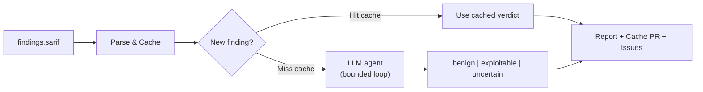

# 🔍 Triage Agent

[](https://github.com/alexpermiakov/sast-triage/actions/workflows/ci.yml)
[](LICENSE)

**You turned on a SAST scanner, got 400 findings, and turned it off.** Most were false positives; nobody had time to check.

`sast-triage` does what a security analyst would: read the code behind each finding, trace the taint, decide if it's real — with cited evidence. PRs fail only on _new exploitable_ findings. Verdicts are cached in git, keyed to the evidence they cite, and approved by humans via PR. After the first run, triage costs ~$0.

### How it works



**Safety bounds:**

- Read-only tools (`read_file`, `grep_repo`) only — no writes, no exec
- Token & iteration budgets per finding; findings cap per run
- Three-valued verdicts (no unsafe defaults)
- Cache invalidation on code change

**What about prompt injection — a comment claiming "this is safe"?** Repo content enters the prompt as evidence, never as instructions. A `benign` verdict requires cited `file:line` evidence that the tool re-verifies — prose claims don't meet the bar. The worst case for a fooled model is a wrong verdict, and the dangerous direction (false `benign`) demands the most proof, is human-approved in a PR, and auto-expires when any cited line changes.

## Quick Start: CI

CI is the main use case. Add `ANTHROPIC_API_KEY` to your repo secrets, then drop this into `.github/workflows/triage.yml`:

```yaml
name: Triage
on: [pull_request]
permissions:
  contents: read
jobs:
  triage:
    runs-on: ubuntu-latest
    steps:
      - uses: actions/checkout@v7
      - uses: actions/setup-go@v7
        with: { go-version: stable }
      - run: GOBIN=/usr/local/bin go install github.com/alexpermiakov/sast-triage/cmd/sast-triage@latest

      - name: Scan with opengrep → findings.sarif
        run: |
          curl -fsSLo /usr/local/bin/opengrep \
            https://github.com/opengrep/opengrep/releases/download/v1.25.0/opengrep_manylinux_x86
          chmod +x /usr/local/bin/opengrep
          git clone --depth 1 https://github.com/opengrep/opengrep-rules /tmp/rules
          opengrep scan -f /tmp/rules/go --sarif --dataflow-traces --output findings.sarif

      - name: Triage — fail only on NEW exploitable findings
        env:
          ANTHROPIC_API_KEY: ${{ secrets.ANTHROPIC_API_KEY }}
        run: sast-triage -sarif findings.sarif -repo . -fail-on-new-exploitable
```

Swap `/tmp/rules/go` for your languages' [rule dirs](https://github.com/opengrep/opengrep-rules). For production, use the [workflow this repo runs on itself](.github/workflows/triage.yml): everything pinned (actions by SHA, opengrep by sha256, rules by commit), plus a push-to-main job that files issues for exploitables, uploads triaged results to the Security tab, and maintains the cache review PR — merging that PR is what makes later runs cache hits.

## Run it directly

For a one-off triage outside CI:

```bash
go install github.com/alexpermiakov/sast-triage/cmd/sast-triage@latest
export ANTHROPIC_API_KEY=sk-ant-...

# 1. Scan — anything emitting SARIF 2.1.0 with stable fingerprints works;
#    opengrep (binary: github.com/opengrep/opengrep/releases) is what's tested
git clone --depth 1 https://github.com/opengrep/opengrep-rules /tmp/opengrep-rules
opengrep scan -f /tmp/opengrep-rules/go --sarif --dataflow-traces --output findings.sarif

# 2. Triage (defaults: -cache triage-cache.json -report triage-report.md)
sast-triage -sarif findings.sarif -repo .

cat triage-report.md
```

Outputs: `triage-report.md` (read this), `triage-cache.json` (commit this — it's the agent's memory). Requires Go 1.22+ and an [Anthropic API key](https://console.anthropic.com).

<details>
<summary><strong>Flags</strong></summary>

| Flag                       | Default           | Purpose                                          |
| -------------------------- | ----------------- | ------------------------------------------------ |
| `-effort`                  | `medium`          | Depth: `small`, `medium`, `large`                |
| `-max-findings-budget`     | `50`              | Max findings triaged per run                     |
| `-fail-on-new-exploitable` | off               | Exit 3 if any new exploitable found              |
| `-model`                   | `claude-sonnet-5` | Anthropic model                                  |
| `-parallel`                | `4`               | Concurrent findings                              |
| `-create-issues`           | off               | File GitHub issues for exploitable findings      |
| `-link-base`               | —                 | E.g., `https://github.com/owner/repo/blob/<sha>` |

**Effort presets** (scale per-finding budgets):

| Effort   | read_file lines | grep matches | token budget | iterations |
| -------- | --------------- | ------------ | ------------ | ---------- |
| `small`  | 100             | 25           | 30k          | 6          |
| `medium` | 200             | 50           | 60k          | 10         |
| `large`  | 400             | 100          | 120k         | 15         |

</details>

## Cost Examples

| Scenario                          | Tokens    | Cost        |
| --------------------------------- | --------- | ----------- |
| First run (50 findings, `medium`) | ~60k–300k | $0.30–$1.50 |
| Second run (cache hits)           | ~0        | ~$0         |
| Incremental (1 new + 49 cache)    | ~6k       | $0.03       |

Typical finding: 2k–6k tokens. Bootstrap is expensive; everything after is cheap.

## Features

- ✅ **Evidence-keyed caching** — verdicts auto-expire when cited code changes
- ✅ **Bounded loops** — no runaway LLM calls; iteration & token budgets per finding
- ✅ **Read-only tools** — no code generation, no writes, no surprises
- ✅ **PR review workflow** — cache updates land in a single review PR, human-vetted
- ✅ **CI integration** — fail PR only on _new_ exploitable findings
- ✅ **Security tab integration** — triaged SARIF uploads to GitHub Code Scanning; benign findings arrive dismissed, with the reason as justification
- ✅ **Multi-scanner support** — SARIF 2.1.0 with stable fingerprints

## FAQ

<details>
<summary><strong>Why commit the cache to git?</strong></summary>

- Per-finding granularity (vs. ignore files and inline suppression comments)
- Non-destructive (verdicts, not deletions)
- Carries reason, evidence, timestamps
- PR diffs are audit trails

</details>

<details>
<summary><strong>Does it only work with opengrep?</strong></summary>

No. It consumes SARIF 2.1.0 from any scanner. opengrep and semgrep are what's tested — their `matchBasedId` fingerprints and dataflow traces are used directly. Anything else that speaks SARIF (CodeQL, Snyk Code, gosec, Bandit, Brakeman, SonarQube, ...) works too: when a scanner emits no stable fingerprint, a synthetic one is derived from rule + location, and scanner quirks belong in `internal/sarif` adapters — a parsing problem, not a prompting problem.

</details>

<details>
<summary><strong>Can I use OpenAI or Gemini?</strong></summary>

Yes. The agent uses a minimal `Client` interface ([`internal/agent/client.go`](internal/agent/client.go)); Anthropic is one implementation. Add another by implementing the interface.

</details>

<details>
<summary><strong>Why doesn't the agent write fixes?</strong></summary>

Scope. Triage is a judgment task with a verifiable output contract. Write access would turn a wrong verdict into a wrong commit. Judgment only.

</details>

## Development

<details>
<summary><strong>Testing & Architecture</strong></summary>

```bash
go vet ./...
go test -race ./...
```

- Pure packages (`sarif`, `cache`, `report`) are table-tested against fixtures
- `internal/agent` uses a fake client replaying scripted tool-use transcripts
- Architecture decisions: [docs/DESIGN.md](docs/DESIGN.md)

</details>

---

**License:** MIT | **SAST findings triage with LLM agents, bounded and cached**

