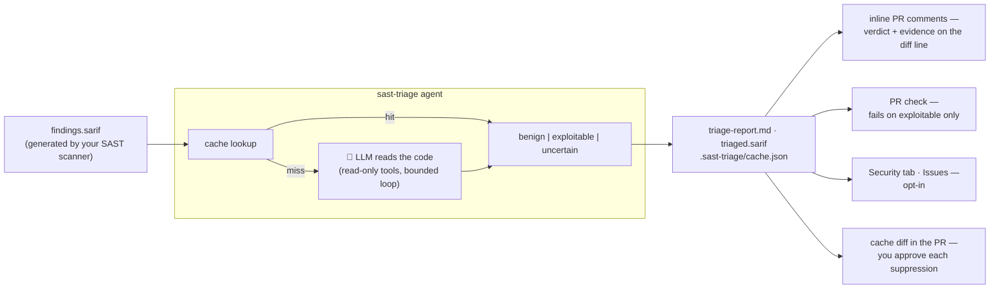

# sast-triage

[](https://github.com/alexpermiakov/sast-triage/actions/workflows/ci.yml)
[](https://github.com/alexpermiakov/sast-triage/actions/workflows/triage-pr.yml)
[](go.mod)
[](LICENSE)

**A SAST scanner alone — Semgrep, opengrep, CodeQL, gosec — fails your CI on noise. Put `sast-triage` after it, and CI fails on vulnerabilities only.**

An LLM agent reads the code behind each finding; only `exploitable` verdicts — with cited `file:line` evidence — block the PR (`mode: report` makes it advisory).

<!-- TODO(launch): hero screenshot — Actions run summary of the real-project eval run, showing the report header + one benign verdict with evidence -->

## How it works



## Quick Start

_Any SARIF 2.1.0 scanner · any OpenAI-compatible or Anthropic model — Ollama and vLLM included, nothing leaves your runner_

<details open>
<summary><b>Step 1: seed the cache</b> — one <code>workflow_dispatch</code> run, one review PR, merged once</summary>

Save this as `.github/workflows/triage-seed.yml` and run it from the Actions tab:

```yaml
name: Triage (seed)
on: workflow_dispatch
permissions:
  contents: write # push the seed branch
  pull-requests: write # open the seed PR
jobs:
  seed:
    runs-on: ubuntu-latest
    steps:
      - uses: actions/checkout@v7

      # Your scanner goes here — Semgrep, CodeQL, Opengrep, Snyk Code, anything emitting SARIF 2.1.0
      - name: Scan → findings.sarif
        run: |1
          pipx install semgrep
          semgrep scan --sarif-output=findings.sarif

      - name: Triage
        uses: alexpermiakov/sast-triage@v1
        with:
          provider: anthropic
          model: claude-sonnet-5
          api-key: ${{ secrets.ANTHROPIC_API_KEY }}
          sarif-file: findings.sarif # the file the scan step wrote
          scope: full # every finding in the SARIF, not just changed files
          mode: baseline # triage everything, never fail the build
          cache-write: pr # one PR titled "seed sast-triage cache"
```

</details>

<details>
<summary><b>Step 2: gate pull requests</b> — diff-scoped, inline comments, cache on the PR's own branch</summary>

Save as `.github/workflows/triage-pr.yml`:

```yaml
name: Triage (PR)
on: pull_request
permissions:
  contents: write # commit the cache delta to the PR head branch
  pull-requests: write # inline review comments
jobs:
  triage:
    runs-on: ubuntu-latest
    steps:
      - uses: actions/checkout@v7
        with:
          fetch-depth: 0 # need the base branch to diff against
          ref: ${{ github.event.pull_request.head.sha }} # the PR head, not the merge commit

      # Your scanner goes here — Semgrep, CodeQL, Opengrep, Snyk Code, anything emitting SARIF 2.1.0
      - name: Scan → findings.sarif
        run: |
          pipx install semgrep
          semgrep scan --sarif-output=findings.sarif

      - name: Triage
        uses: alexpermiakov/sast-triage@v1
        with:
          provider: anthropic
          model: claude-sonnet-5
          api-key: ${{ secrets.ANTHROPIC_API_KEY }}
          sarif-file: findings.sarif # the file the scan step wrote
          scope: diff # only findings in files this PR changed
          base-ref: origin/${{ github.base_ref }} # what "changed" is measured against
          mode: enforce # fail the check on exploitable findings
          cache-write: branch # commit to the PR's own head branch
          pr-comments: "true" # verdicts inline on the diff
```

After seeding, this is nearly invisible: a typical feature PR triages a handful of findings, adds a couple of cache lines, and passes.

</details>

<details>
<summary><b>Step 3 (optional): run on a schedule</b> — full repo, advisory, catches what diff scope can't</summary>

Save as `.github/workflows/triage-scheduled.yml`:

```yaml
name: Triage (scheduled)
on:
  schedule: [{ cron: "0 3 * * *" }]
permissions:
  contents: read
jobs:
  triage:
    runs-on: ubuntu-latest
    steps:
      - uses: actions/checkout@v7
      - name: Scan → findings.sarif
        run: |
          pipx install semgrep
          semgrep scan --sarif-output=findings.sarif

      - name: Triage
        uses: alexpermiakov/sast-triage@v1
        with:
          provider: anthropic
          model: claude-sonnet-5
          api-key: ${{ secrets.ANTHROPIC_API_KEY }}
          sarif-file: findings.sarif # the file the scan step wrote
          scope: full # every finding in the SARIF, not just changed files
          mode: report # never fails the build
          cache-write: none # artifact only, no commit
```

What this buys you: diff scope has a structural hole — a change in `Foo.java` can make a _pre-existing_ finding in `Bar.java` exploitable, and nothing keyed on changed files will ever see it. (Semgrep's baseline mode has the same hole.) A periodic full-repo run is what closes it: `scope: full` re-asks every finding against today's code, so a verdict reached before `Foo.java` changed gets revisited whether or not the finding's own file was touched. After seeding, almost all of that is cache hits — an entry is only re-triaged when its flagged region or one of its cited evidence regions has drifted — so the nightly `cron: "0 3 * * *"` above costs a handful of model calls, not a full re-scan. With `mode: report` and `cache-write: none` it cannot fail a build or push a commit either; it just files the report.

</details>

On a different provider? Drop `provider` and name the endpoint instead:

```yaml
with:
  base-url: https://api.deepseek.com/v1
  model: deepseek-v4-pro
  api-key: ${{ secrets.DEEPSEEK_API_KEY }}
```

The workflows this repo runs on itself are the copy-paste source: [triage-seed.yml](.github/workflows/triage-seed.yml), [triage-pr.yml](.github/workflows/triage-pr.yml).

<details>
<summary><b>Self-hosted model</b> (Ollama, vLLM, LM Studio) — no API key, no cost, nothing leaves the runner</summary>

Built for your own on-premise runners: the model sits next to the code and nothing crosses the fence.

```yaml
name: Triage
on: [pull_request]
permissions:
  contents: read
jobs:
  triage:
    runs-on: ubuntu-latest
    services:
      ollama:
        image: ollama/ollama:latest
        ports: ["11434:11434"]
    steps:
      - uses: actions/checkout@v7
        with:
          fetch-depth: 0
          ref: ${{ github.event.pull_request.head.sha }}
      - run: curl -fsS http://localhost:11434/api/pull -d '{"name":"qwen2.5-coder:1.5b-instruct"}'

      # Your scanner goes here — CodeQL, gosec, Snyk Code, anything emitting SARIF 2.1.0
      - name: Scan → findings.sarif
        run: |
          pipx install semgrep
          semgrep scan --sarif-output=findings.sarif

      - name: Triage
        uses: alexpermiakov/sast-triage@v1
        with:
          base-url: http://localhost:11434/v1
          model: qwen2.5-coder:1.5b-instruct
          scope: diff
          base-ref: origin/${{ github.base_ref }}
          mode: enforce
```

`base-url` + `model` point at any OpenAI-compatible server — swap in vLLM or LM Studio by changing the URL. That 1.5b model on `ubuntu-latest` proves the plumbing, not the judgment — for real local verdicts use `runs-on: [self-hosted, gpu]` and the biggest code model your hardware fits, and expect more `uncertain` than a frontier model leaves behind.

</details>

<details>
<summary><b>Run it locally on your machine</b> — one-off triage, no CI</summary>

Nothing is sent anywhere you didn't name: `-base-url` is always explicit, so pointing it at local Ollama keeps everything on your machine.

```bash
go install github.com/alexpermiakov/sast-triage/cmd/sast-triage@latest

# 1. Scan — anything emitting SARIF 2.1.0 works; semgrep needs no rules setup
pipx install semgrep
semgrep scan --sarif-output=findings.sarif

# 2a. Triage with a local model via Ollama…
ollama serve &                        # http://localhost:11434
ollama pull qwen2.5-coder:7b
sast-triage -sarif-file findings.sarif -repo . \
  -base-url http://localhost:11434/v1 -model qwen2.5-coder:7b

# 2b. …or with Claude (needs ANTHROPIC_API_KEY in your environment)
export ANTHROPIC_API_KEY=sk-ant-...
sast-triage -sarif-file findings.sarif -repo . \
  -provider anthropic -model claude-sonnet-5

cat triage-report.md

# Only what your branch changed, gating on exploitables — the PR check, locally
sast-triage -provider anthropic -model claude-sonnet-5 \
  -scope diff -base-ref origin/main -mode enforce
```

</details>

## What you get

- ✅ **A gate that only fires on `exploitable`** (`mode: enforce`, exit 3) — never on `uncertain`, never on the backlog. A gate that fires on noise is a gate that gets disabled in a week, so this one doesn't
- ✅ **Filtered SARIF on every run** (`triaged.sarif`, on by default) — benign findings are relabelled via `suppressions[]`, never deleted. Upload it to the Security tab with `github/codeql-action/upload-sarif`, or hand it to DefectDojo
- ✅ **Inline PR comments** (`pr-comments: true`) — the verdict, the reasoning, and the cited evidence land on the diff line, where the review already is
- ✅ **`triage-report.md`** — every verdict with its reasoning and clickable `file:line` evidence, proposed suppressions first so vetoing one is a 30-second action. Complete and uncapped; keep it with `actions/upload-artifact`
- ✅ **Human-approved verdicts** — the run updates `.sast-triage/cache.json`; it reaches `main` through a normal PR merge, so every suppression is a readable diff nobody can skip
- ✅ **GitHub issues for confirmed vulnerabilities** (opt-in `create-issues:`) — one per finding, deduped across runs, with the evidence in the body
- ✅ **Any SARIF 2.1.0 scanner** — Semgrep, CodeQL, Snyk Code, gosec, Bandit, …

## Reference

Everything below has a working default — the quick starts above set `model`, `api-key`, and nothing else.

<details>
<summary><b>What it costs</b> — a full run on OWASP BenchmarkJava, 2,376 findings</summary>

[BenchmarkJava](https://github.com/OWASP-Benchmark/BenchmarkJava) is the corpus this is measured on: one scan produces 2,376 findings, and a finding takes ~25k tokens to triage at `medium` effort — the agent re-sends the conversation each turn, so nearly all of that is input.

| Model             | Per finding | All 2,376 findings   |
| ----------------- | ----------- | -------------------- |
| `DeepSeek-V4-Pro` | $0.003      | **$7.60** (measured) |
| Claude Sonnet 5   | ~$0.09      | ~$220 (estimated)    |
| Local Ollama      | $0          | $0                   |

Only the first run costs anything. Every finding after that is a cache hit until the code it cites changes, so re-running the same 2,376 findings is ~$0 and a PR that adds one new finding costs one finding.

That is the whole backlog, once — against $15k–18k a year for a 50-developer seat licence.

</details>

<details>
<summary><b>All flags & action inputs</b></summary>

The GitHub Action exposes every flag as an input of the same name, minus the leading dash — `-base-url` becomes `base-url:`, `-base-ref` becomes `base-ref:` — with identical defaults:

| Flag                   | Default                   | Purpose                                                                                    |
| ---------------------- | ------------------------- | ------------------------------------------------------------------------------------------ |
| `-provider`            | inferred                  | Only needed for `anthropic` (Claude's native API); `-base-url` alone implies `openai`      |
| `-base-url`            | —                         | The endpoint. **No default** — the tool only ever talks to the host you name               |
| `-model`               | —                         | **Required, no default** — e.g. `claude-sonnet-5` (anthropic), `qwen2.5-coder:7b` (openai) |
| `-scope`               | `full`                    | `full` (everything in the SARIF) or `diff` (only findings in changed files)                |
| `-base-ref`            | —                         | Base to diff against for `-scope diff`, e.g. `origin/main`. Required with it               |
| `-mode`                | `enforce`                 | `enforce` (exit 3 on exploitables in scope), `report` (advisory), `baseline` (seeding)     |
| `-sarif-file`          | `findings.sarif`          | SARIF 2.1.0 input                                                                          |
| `-repo`                | `.`                       | Repository root the findings refer to                                                      |
| `-cache`               | `.sast-triage/cache.json` | Verdict cache (commit it to git)                                                           |
| `-report`              | `triage-report.md`        | Markdown report output — complete, uncapped                                                |
| `-digest`              | `triage-digest.md`        | Size-bounded report for the step summary; `""` skips it                                    |
| `-digest-bytes`        | `50000`                   | Digest cap — clears both the 1 MiB summary and 65,536-char PR body limits                  |
| `-summary`             | `triage-summary.md`       | Headline + one bounded verdict table (15 rows) — the seed PR body; `""` skips it           |
| `-run-url`             | —                         | CI run URL linked from the summary footer (the action fills it in)                         |
| `-triaged-sarif`       | `triaged.sarif`           | SARIF copy with benign findings relabelled via `suppressions[]`; `""` skips it             |
| `-effort`              | `medium`                  | Depth: `small`, `medium`, `large`, `xlarge`                                                |
| `-max-findings-budget` | `50`                      | Max findings triaged per run (0 = unlimited)                                               |
| `-parallel`            | `4`                       | Concurrent findings                                                                        |
| `-pr` / `-commit`      | —                         | PR number + head SHA for inline comments (the action fills both from the event)            |
| `-create-issues`       | off                       | File GitHub issues for exploitables (needs `GITHUB_TOKEN`)                                 |
| `-github-repo`         | `$GITHUB_REPOSITORY`      | `owner/name` for issue creation                                                            |
| `-link-base`           | —                         | E.g., `https://github.com/owner/repo/blob/<sha>`                                           |

Two action inputs have no flag behind them, because they are git plumbing rather than triage logic: **`cache-write`** (`branch` | `pr` | `none`) decides where the cache delta goes, and **`pr-comments`** (`true` | `false`) turns on inline comments, filling `-pr` and `-commit` from the event payload.

The action also takes `api-key` (routed to whichever provider you selected), plus `anthropic-api-key` / `openai-api-key` if you'd rather be explicit.

**Exit codes:** `0` success (whatever the verdicts), `1` tool failure, `2` usage error, `3` gate tripped — `-mode enforce` found exploitable findings in scope.

</details>

<details>
<summary><b>Effort presets</b> — reach for these when you get too many <code>uncertain</code> verdicts</summary>

`-effort` sets how much the agent may read and how long it may work on one finding; when the budget runs out, the verdict falls back to `uncertain`. So a run that returns more `uncertain` than you'd like is usually a reason to go up a preset (and a weaker model is a reason to expect them regardless):

| Effort   | read_file lines | grep matches | token budget | iterations |
| -------- | --------------- | ------------ | ------------ | ---------- |
| `small`  | 100             | 25           | 30k          | 6          |
| `medium` | 200             | 50           | 60k          | 10         |
| `large`  | 400             | 100          | 120k         | 15         |
| `xlarge` | 800             | 200          | 240k         | 22         |

`-token-budget` and `-max-iterations` override the preset individually.

</details>

## FAQ

<details>
<summary><strong>What keeps the agent in bounds?</strong></summary>

- **Read-only tools** — `read_file` and `grep_repo` only; no writes, no exec
- **Token & iteration budgets** — 10 iterations / 60k tokens per finding by default, plus a 50-findings cap per run; the loop always terminates
- **Three-valued verdicts** — `benign` requires cited `file:line` evidence; ambiguity or budget exhaustion → `uncertain`, never `benign`
- **Cache invalidation on code change** — a verdict expires the moment any line it cited changes

</details>

<details>
<summary><strong>How accurate is it?</strong></summary>

<!-- TODO(launch): replace this paragraph with the real-project eval before posting:
     "<scanner> emitted N findings on <repo>; X benign / Y exploitable / Z uncertain,
     $C total. We hand-checked M of the benign verdicts: K correct, and here are the
     ones it got wrong." The hand-verified benign sample is the number that matters. -->

Accuracy is deliberately asymmetric. The dangerous mistake — suppressing a real vulnerability — has to clear three bars: cited `file:line` evidence the tool re-verifies, a human merging the cache review PR, and a codeHash that expires the verdict the moment any cited line changes. The cheap mistake — `uncertain` on something a human could resolve — costs a retry, not a missed vuln. A weaker model shifts verdicts toward `uncertain`, never toward silent `benign`.

</details>

<details>
<summary><strong>What if it marks a real vulnerability benign?</strong></summary>

Three independent layers have to fail at once:

- the verdict needs cited `file:line` evidence that the tool re-verifies — no evidence, no `benign`; ambiguity becomes `uncertain`, which never suppresses
- the suppression takes effect only after a human merges the cache review PR, where it appears as a readable diff with the reasoning inline
- any change to a cited line breaks the codeHash and expires the verdict — a wrong verdict doesn't outlive the code it misjudged

</details>

<details>
<summary><strong>Why not Semgrep Assistant or GitHub Code Security's AI triage?</strong></summary>

Same job, different constraints. Those are good products if you're already paying for the tier that includes them. This exists for everyone else:

- $0 per developer — MIT licence, runs as a step in the CI you already have
- bring your own model, including a local one — code never has to leave your runner
- verdicts live in your repo as a reviewable git history, not in a vendor dashboard
- consumes any SARIF scanner's output, not one vendor's

</details>

<details>
<summary><strong>Which languages does it support?</strong></summary>

Whatever your scanner scans. The agent doesn't parse code — it reads it the way an analyst would (`read_file`, `grep_repo`), so there is no per-language support matrix: if the scanner produced a finding, it can be triaged.

</details>

<details>
<summary><strong>What makes a PR fail, and who approves verdicts?</strong></summary>

A PR fails when `mode: enforce` and the run finds an **exploitable** verdict in scope (exit 3). Never on `uncertain`, never on `benign`, and never on findings outside the change — `scope: diff` means the gate only ever considers files the PR touched. That is what makes it a gate people leave on.

Note what the gate does _not_ depend on: whether a verdict was decided this run or came from the cache. Making the exit code a function of cache state means the same code passes or fails depending on who merged a cache update first, and a wiped cache turns your whole backlog into "new". Scope is what keeps the backlog out, not cache freshness.

Verdicts live in git (`.sast-triage/cache.json`), keyed to the evidence they cite, and are approved by humans: the seed PR for the initial backlog, then each feature PR's own cache diff. One exception, stated out loud when it happens — on a repo with **no cache at all**, `enforce` reports instead of failing and tells you to seed first, because there is no reviewed baseline for it to be enforcing against.

</details>

<details>
<summary><strong>What about prompt injection — a comment claiming "this is safe"?</strong></summary>

Repo content enters the prompt as evidence, never as instructions. A `benign` verdict requires cited `file:line` evidence that the tool re-verifies — prose claims don't meet the bar. The worst case for a fooled model is a wrong verdict, and the dangerous direction (false `benign`) demands the most proof, is human-approved in a PR, and auto-expires when any cited line changes.

</details>

<details>
<summary><strong>What happens if I delete the cache file?</strong></summary>

You pay for one full run again, and nothing else. A missing, wiped, or hand-mangled entry causes **re-triage** — it can never produce a `benign`. `benign` with no cited evidence, a hash that doesn't match, an unparseable evidence ref, a verdict string nobody models: every one of them is a miss, and a miss means the finding gets triaged again from scratch. That invariant is pinned by [`TestDamagedEntryNeverSuppresses`](internal/cache/safety_test.go).

</details>

<details>
<summary><strong>Why commit the cache to git?</strong></summary>

- Per-finding granularity (vs. ignore files and inline suppression comments)
- Non-destructive (verdicts, not deletions)
- Carries reason, evidence, timestamps
- PR diffs are audit trails

</details>

<details>
<summary><strong>Which scanners work?</strong></summary>

Any of them: it consumes SARIF 2.1.0, whoever produced it.

opengrep and semgrep are the two that are tested, and they do not hand you the same thing. opengrep emits real `matchBasedId/v1` fingerprints and `codeFlows` taint traces — the trace reaches the agent as numbered hops to verify, so its budget goes on checking a flow rather than finding one. Semgrep run without a platform login emits the literal `"requires login"` for every fingerprint, and semgrep 1.170.0 emits no `codeFlows` even with `--dataflow-traces` (documented since v0.120.0, so treat this as a bug that may come back rather than a permanent limit). Those findings fall back to a synthetic id — rule + location + snippet — and the agent starts from the flagged line alone. Both are safe: a synthetic id is still unique per run, and thin evidence resolves to `uncertain`, never `benign`. The semgrep path just spends more tokens per finding and returns more `uncertain`. This repo's own CI runs the semgrep step the quick start shows. Anything else that speaks SARIF (CodeQL, Snyk Code, gosec, Bandit, Brakeman, SonarQube, ...) works too: scanner quirks belong in `internal/sarif` adapters — a parsing problem, not a prompting problem.

</details>

<details>
<summary><strong>Which models can I use?</strong></summary>

Any OpenAI-compatible endpoint out of the box — Ollama, vLLM, LM Studio, DeepSeek, Kimi, OpenAI itself: name it with `-base-url` and `-model`, and that's the whole configuration. Claude via `-provider anthropic`, the one API that isn't OpenAI-shaped. Both are thin adapters over a one-method `Client` interface ([`internal/agent/client.go`](internal/agent/client.go)); a new provider is one file implementing `Complete`. The verdict logic is fail-closed, so a weaker local model produces more `uncertain` verdicts, never silent `benign` ones — and the cache records which model decided each verdict.

Honest quality guidance: `DeepSeek-V4-Pro` is what this repo's CI uses and what produced the verdicts in [.sast-triage/cache.json](.sast-triage/cache.json) — chosen because it triages the whole backlog for a few dollars. The tiny CPU model in the self-hosted quick-start (`qwen2.5-coder:1.5b`) proves the plumbing, not the judgment — expect mostly `uncertain` from it. Triaging locally for real means the biggest code model your hardware runs, and still budgeting for more `uncertain` verdicts than a frontier model leaves behind.

</details>

<details>
<summary><strong>Why doesn't the agent write fixes?</strong></summary>

Scope. Triage is a judgment task with a verifiable output contract. Write access would turn a wrong verdict into a wrong commit. Judgment only.

</details>

