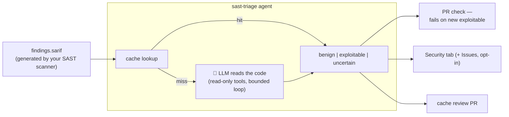

# sast-triage

[](https://github.com/alexpermiakov/sast-triage/actions/workflows/ci.yml)
[](https://github.com/alexpermiakov/sast-triage/actions/workflows/triage.yml)
[](go.mod)
[](LICENSE)

**You turned on a SAST scanner — Semgrep, CodeQL, SonarQube — got 400 findings, and turned it off.** Most were false positives; nobody had time to check.

AI triage for this already exists — Semgrep Teams, GitHub Code Security, and Snyk ship it in their paid tiers at $25–30 per developer per month: a 50-developer team pays $15k–18k a year, and enterprise plans cost more.

`sast-triage` does the same job without the per-developer fee — MIT licence, one Go binary, bring your own model (local Ollama = $0, or your Claude API key).

**It does what a security analyst would**: read the code behind each finding, trace the taint, decide if it's real — with cited evidence. After the first run, triage costs ~$0.

## How it works



### Safety bounds

- **Read-only tools** — `read_file` and `grep_repo` only; no writes, no exec
- **Token & iteration budgets** — 10 iterations / 60k tokens per finding by default, plus a 50-findings cap per run; the loop always terminates
- **Three-valued verdicts** — `benign` requires cited `file:line` evidence; ambiguity or budget exhaustion → `uncertain`, never `benign`
- **Cache invalidation on code change** — a verdict expires the moment any line it cited changes

## Quick Start

<details open>
<summary><b>Claude</b> — what this repo's own CI uses</summary>

Add an `ANTHROPIC_API_KEY` repo secret, then add this to your CI — as a new `.github/workflows/triage.yml`, or copy the `triage` job into a workflow you already have:

```yaml
name: Triage
on: [pull_request]
permissions:
  contents: read
jobs:
  triage:
    runs-on: ubuntu-latest
    steps:
      - uses: actions/checkout@v7

      # → produce findings.sarif with your scanner here (opengrep example below ⬇)

      - name: Triage — fail only on NEW exploitable findings
        uses: alexpermiakov/sast-triage@v1
        with:
          provider: anthropic
          model: claude-sonnet-5
          anthropic-api-key: ${{ secrets.ANTHROPIC_API_KEY }}
```

</details>

<details>
<summary><b>Local model</b> (OpenAI-compatible) — no API key, no cost, nothing leaves the runner</summary>

This path is built for your own on-premise runners: the model sits next to the code and nothing crosses the fence.

```yaml
name: Triage
on: [pull_request]
permissions:
  contents: read
jobs:
  triage:
    runs-on: ubuntu-latest # CPU-only demo; for real verdicts: [self-hosted, gpu] + a bigger model
    services:
      ollama:
        image: ollama/ollama:latest
        ports: ["11434:11434"]
    steps:
      - uses: actions/checkout@v7
      - run: curl -fsS http://localhost:11434/api/pull -d '{"name":"qwen2.5-coder:1.5b-instruct"}'

      # → produce findings.sarif with your scanner here (opengrep example below ⬇)

      - name: Triage — fail only on NEW exploitable findings
        uses: alexpermiakov/sast-triage@v1
        with:
          base-url: http://localhost:11434/v1
          model: qwen2.5-coder:1.5b-instruct
```

The same two inputs point at any OpenAI-compatible endpoint — vLLM, LM Studio, or OpenAI itself.

</details>

<details>
<summary><b>The scan step</b> — producing <code>findings.sarif</code> (opengrep here, but any SARIF scanner works)</summary>

Any scanner that emits SARIF 2.1.0 plugs in — Semgrep, CodeQL, Snyk Code, gosec, Bandit; swap `/tmp/rules/go` for your languages' [rule dirs](https://github.com/opengrep/opengrep-rules):

```yaml
- name: Scan with opengrep → findings.sarif
  run: |
    curl -fsSLo /usr/local/bin/opengrep \
      https://github.com/opengrep/opengrep/releases/download/v1.25.0/opengrep_manylinux_x86
    chmod +x /usr/local/bin/opengrep
    git clone --depth 1 https://github.com/opengrep/opengrep-rules /tmp/rules
    opengrep scan -f /tmp/rules/go --sarif --dataflow-traces --output findings.sarif
```

</details>

<details>
<summary><b>Run it directly</b> — one-off triage outside CI</summary>

Nothing is sent anywhere you didn't name: `-base-url` is always explicit, so pointing it at local Ollama keeps everything on your machine.

```bash
go install github.com/alexpermiakov/sast-triage/cmd/sast-triage@latest

# 1. Scan — anything emitting SARIF 2.1.0 works; opengrep is what's tested
git clone --depth 1 https://github.com/opengrep/opengrep-rules /tmp/rules
opengrep scan -f /tmp/rules/go --sarif --dataflow-traces --output findings.sarif

# 2. Triage — local model via Ollama…
ollama serve &                        # http://localhost:11434
ollama pull qwen2.5-coder:7b
sast-triage -sarif findings.sarif -repo . \
  -base-url http://localhost:11434/v1 -model qwen2.5-coder:7b

#    …or Claude
sast-triage -provider anthropic -model claude-sonnet-5 \
  -sarif findings.sarif -repo .

cat triage-report.md
```

</details>

For production, start from the [workflow this repo runs on itself](.github/workflows/triage.yml).

## Features

- ✅ **PR gate** — fails only on _new_ exploitable findings; the pre-existing backlog never blocks a merge
- ✅ **Human-approved verdicts** — cache updates land in a single review PR
- ✅ **Security tab integration** — triaged SARIF uploads to GitHub Code Scanning; benign findings arrive dismissed, with the reason as justification
- ✅ **Any SARIF 2.1.0 scanner** — Semgrep, CodeQL, Snyk Code, gosec, Bandit, …

## Cost Examples

Estimates at Claude Sonnet pricing, `medium` effort — a typical finding takes 2k–6k tokens:

| Scenario                          | Tokens    | Cost        |
| --------------------------------- | --------- | ----------- |
| First run (50 findings, `medium`) | ~60k–300k | $0.30–$1.50 |
| Second run (cache hits)           | ~0        | ~$0         |
| Incremental (1 new + 49 cache)    | ~6k       | $0.03       |

Only the first run costs real money — after that, the cache answers everything except new findings.

## Flags & action inputs

The GitHub Action exposes every flag as an input of the same name, minus the leading dash — `-base-url` becomes `base-url:`, `-fail-on-new-exploitable` becomes `fail-on-new-exploitable:` — with identical defaults:

| Flag                       | Default              | Purpose                                                                                           |
| -------------------------- | -------------------- | ------------------------------------------------------------------------------------------------- |
| `-provider`                | `openai`             | `openai` (any OpenAI-compatible endpoint — Ollama, vLLM, LM Studio, OpenAI itself) or `anthropic` |
| `-base-url`                | —                    | Endpoint for `openai`; **required, no default** — the tool only ever talks to the host you name   |
| `-model`                   | —                    | **Required, no default** — e.g. `claude-sonnet-5` (anthropic), `qwen2.5-coder:7b` (openai)        |
| `-sarif`                   | `findings.sarif`     | SARIF 2.1.0 input                                                                                 |
| `-repo`                    | `.`                  | Repository root the findings refer to                                                             |
| `-cache`                   | `triage-cache.json`  | Verdict cache (commit it to git)                                                                  |
| `-report`                  | `triage-report.md`   | Markdown report output                                                                            |
| `-triaged-sarif`           | —                    | Verdict-annotated SARIF copy for Code Scanning upload                                             |
| `-effort`                  | `medium`             | Depth: `small`, `medium`, `large`                                                                 |
| `-max-findings-budget`     | `50`                 | Max findings triaged per run (0 = unlimited)                                                      |
| `-parallel`                | `4`                  | Concurrent findings                                                                               |
| `-fail-on-new-exploitable` | on                   | Exit 3 if this run finds a new exploitable; `=false` for runs that must not fail (push to main)   |
| `-create-issues`           | off                  | File GitHub issues for exploitables (needs `GITHUB_TOKEN`)                                        |
| `-github-repo`             | `$GITHUB_REPOSITORY` | `owner/name` for issue creation                                                                   |
| `-link-base`               | —                    | E.g., `https://github.com/owner/repo/blob/<sha>`                                                  |

**Effort presets** — `-effort` sets how much the agent may read and how long it may work on one finding; when the budget runs out, the verdict falls back to `uncertain`:

| Effort   | read_file lines | grep matches | token budget | iterations |
| -------- | --------------- | ------------ | ------------ | ---------- |
| `small`  | 100             | 25           | 30k          | 6          |
| `medium` | 200             | 50           | 60k          | 10         |
| `large`  | 400             | 100          | 120k         | 15         |

## FAQ

<details>
<summary><strong>What makes a PR fail, and who approves verdicts?</strong></summary>

PRs fail only on _new exploitable_ findings (exit 3; the gate is on by default, `-fail-on-new-exploitable=false` turns it off). Verdicts are cached in git (`triage-cache.json`), keyed to the evidence they cite, and approved by humans via the cache review PR. The committed cache is the baseline, so pre-existing backlog never blocks a PR — only what the PR itself introduces.

</details>

<details>
<summary><strong>What about prompt injection — a comment claiming "this is safe"?</strong></summary>

Repo content enters the prompt as evidence, never as instructions. A `benign` verdict requires cited `file:line` evidence that the tool re-verifies — prose claims don't meet the bar. The worst case for a fooled model is a wrong verdict, and the dangerous direction (false `benign`) demands the most proof, is human-approved in a PR, and auto-expires when any cited line changes.

</details>

<details>
<summary><strong>Why commit the cache to git?</strong></summary>

- Per-finding granularity (vs. ignore files and inline suppression comments)
- Non-destructive (verdicts, not deletions)
- Carries reason, evidence, timestamps
- PR diffs are audit trails

</details>

<details>
<summary><strong>Does it only work with opengrep?</strong></summary>

No. It consumes SARIF 2.1.0 from any scanner. opengrep and semgrep are what's tested — their `matchBasedId` fingerprints and dataflow traces are used directly. Anything else that speaks SARIF (CodeQL, Snyk Code, gosec, Bandit, Brakeman, SonarQube, ...) works too: when a scanner emits no stable fingerprint, a synthetic one is derived from rule + location, and scanner quirks belong in `internal/sarif` adapters — a parsing problem, not a prompting problem.

</details>

<details>
<summary><strong>Which models can I use?</strong></summary>

Any OpenAI-compatible endpoint out of the box (`-provider openai`, the default): Ollama, vLLM, LM Studio, or OpenAI itself — pick with `-base-url` and `-model`. Claude via `-provider anthropic`. Both are thin adapters over a one-method `Client` interface ([`internal/agent/client.go`](internal/agent/client.go)); a new provider is one file implementing `Complete`. The verdict logic is fail-closed, so a weaker local model produces more `uncertain` verdicts, never silent `benign` ones — and the cache records which model decided each verdict.

</details>

<details>
<summary><strong>Why doesn't the agent write fixes?</strong></summary>

Scope. Triage is a judgment task with a verifiable output contract. Write access would turn a wrong verdict into a wrong commit. Judgment only.

</details>

