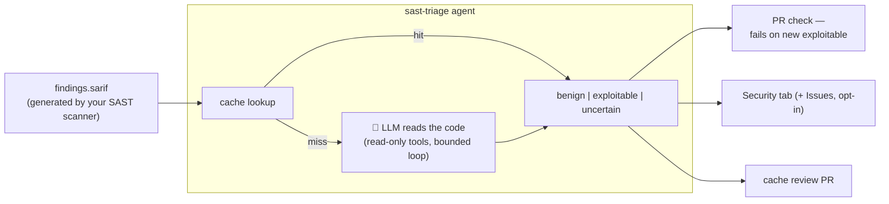

# sast-triage

[](https://github.com/alexpermiakov/sast-triage/actions/workflows/ci.yml)
[](https://github.com/alexpermiakov/sast-triage/actions/workflows/triage.yml)
[](go.mod)
[](LICENSE)

**You turned on a SAST scanner — Semgrep, CodeQL, SonarQube — got 400 findings, and turned it off.** Most were false positives; nobody had time to check.

AI triage for this already exists — Semgrep Teams, GitHub Code Security, and Snyk ship it in their paid tiers at $25–30 per developer per month: a 50-developer team pays $15k–18k a year, and enterprise plans cost more.

**sast-triage** does the same job without the per-developer fee — MIT licence, one Go binary, bring your own model (local Ollama = $0, or your Claude API key).

**It does what a security analyst would**: read the code behind each finding, trace the taint, decide if it's real — with cited evidence. Nothing is suppressed on the model's word alone: every `benign` verdict lands as a reviewable PR diff, and a human merges it. After the first run, triage costs ~$0.

<!-- TODO(launch): hero screenshot — Actions run summary of the real-project eval run, showing the report header + one benign verdict with evidence -->

## How it works



### Safety bounds

- **Read-only tools** — `read_file` and `grep_repo` only; no writes, no exec
- **Token & iteration budgets** — 10 iterations / 60k tokens per finding by default, plus a 50-findings cap per run; the loop always terminates
- **Three-valued verdicts** — `benign` requires cited `file:line` evidence; ambiguity or budget exhaustion → `uncertain`, never `benign`
- **Cache invalidation on code change** — a verdict expires the moment any line it cited changes

## Quick Start

Three complete paths — each one is a working setup end to end, scanner included. Pick one, add the key, done.

<details open>
<summary><b>Hosted API</b> (Claude, DeepSeek, Kimi, OpenAI, …) — what this repo's own CI uses</summary>

Add an `LLM_API_KEY` repo secret — a key from any provider below — then save this as `.github/workflows/triage.yml`, or copy the `triage` job into a workflow you already have:

```yaml
name: Triage
on: [pull_request]
permissions:
  contents: read
jobs:
  triage:
    runs-on: ubuntu-latest
    steps:
      - uses: actions/checkout@v7

      # Your SAST tool goes here — semgrep, opengrep, CodeQL, gosec, … anything emitting SARIF
      - name: Scan → findings.sarif
        run: |
          pipx install semgrep
          semgrep scan --config=auto --dataflow-traces --sarif-output=findings.sarif

      - name: Triage
        uses: alexpermiakov/sast-triage@v1
        with:
          api-key: ${{ secrets.LLM_API_KEY }}

          # Claude — what this repo's CI runs:
          provider: anthropic
          model: claude-sonnet-5

          # …or any OpenAI-compatible API - swap the two lines above for these:
          # base-url: https://api.deepseek.com/v1
          # model: DeepSeek-V4-Pro
```

</details>

<details>
<summary><b>Self-hosted model</b> (Ollama, vLLM, LM Studio) — no API key, no cost, nothing leaves the runner</summary>

Built for your own on-premise runners: the model sits next to the code and nothing crosses the fence.

```yaml
name: Triage
on: [pull_request]
permissions:
  contents: read
jobs:
  triage:
    runs-on: ubuntu-latest # CPU-only demo; for real verdicts: [self-hosted, gpu] + a bigger model
    services:
      ollama:
        image: ollama/ollama:latest
        ports: ["11434:11434"]
    steps:
      - uses: actions/checkout@v7
      - run: curl -fsS http://localhost:11434/api/pull -d '{"name":"qwen2.5-coder:1.5b-instruct"}'

      # Your SAST tool goes here — semgrep, opengrep, CodeQL, gosec, … anything emitting SARIF
      - name: Scan → findings.sarif
        run: |
          pipx install semgrep
          semgrep scan --config=auto --dataflow-traces --sarif-output=findings.sarif

      - name: Triage — fail only on NEW exploitable findings
        uses: alexpermiakov/sast-triage@v1
        with:
          base-url: http://localhost:11434/v1
          model: qwen2.5-coder:1.5b-instruct
```

`base-url` + `model` point at any OpenAI-compatible server — swap in vLLM or LM Studio by changing the URL. That 1.5b model proves the plumbing, not the judgment — for real local verdicts run the biggest code model your hardware fits, and expect more `uncertain` than a frontier model leaves behind.

</details>

<details>
<summary><b>Run it locally on your machine</b> — one-off triage, no CI</summary>

Nothing is sent anywhere you didn't name: `-base-url` is always explicit, so pointing it at local Ollama keeps everything on your machine.

```bash
go install github.com/alexpermiakov/sast-triage/cmd/sast-triage@latest

# 1. Scan — anything emitting SARIF 2.1.0 works; semgrep needs no rules setup
pipx install semgrep
semgrep scan --config=auto --dataflow-traces --sarif-output=findings.sarif

# 2a. Triage with a local model via Ollama…
ollama serve &                        # http://localhost:11434
ollama pull qwen2.5-coder:7b
sast-triage -sarif findings.sarif -repo . \
  -base-url http://localhost:11434/v1 -model qwen2.5-coder:7b

# 2b. …or with Claude (needs ANTHROPIC_API_KEY in your environment)
export ANTHROPIC_API_KEY=sk-ant-...
sast-triage -sarif findings.sarif -repo . \
  -provider anthropic -model claude-sonnet-5

cat triage-report.md
```

</details>

For production, start from the [workflow this repo runs on itself](.github/workflows/triage.yml).

## What you get

The headline behavior is the **PR gate**: the check fails (exit 3) only on _new_ exploitable findings — the 400-finding backlog is baselined in the committed cache and never blocks a merge again. Around it:

- ✅ **A triage report** (`triage-report.md`, also published to the Actions run summary) — every verdict with its reasoning and clickable `file:line` evidence, proposed suppressions first so vetoing one is a 30-second action
- ✅ **Human-approved verdicts** — cache updates land in a single review PR; nothing is suppressed until a human merges it
- ✅ **Security tab integration** — triaged SARIF uploads to GitHub Code Scanning; benign findings arrive dismissed, with the reason as justification
- ✅ **GitHub issues for confirmed vulnerabilities** (opt-in `-create-issues`) — one per finding, deduped across runs, with the evidence in the body
- ✅ **Any SARIF 2.1.0 scanner** — Semgrep, CodeQL, Snyk Code, gosec, Bandit, …

## Cost Examples

Estimates at Claude Sonnet pricing, `medium` effort — a typical finding takes 2k–6k tokens:

| Scenario                          | Tokens    | Cost        |
| --------------------------------- | --------- | ----------- |
| First run (50 findings, `medium`) | ~60k–300k | $0.30–$1.50 |
| Second run (cache hits)           | ~0        | ~$0         |
| Incremental (1 new + 49 cache)    | ~6k       | $0.03       |

Only the first run costs real money — after that, the cache answers everything except new findings.

## Reference

Everything below has a working default — the quick starts above set `model`, `api-key`, and nothing else.

<details>
<summary><b>All flags & action inputs</b></summary>

The GitHub Action exposes every flag as an input of the same name, minus the leading dash — `-base-url` becomes `base-url:`, `-fail-on-new-exploitable` becomes `fail-on-new-exploitable:` — with identical defaults:

| Flag                       | Default              | Purpose                                                                                           |
| -------------------------- | -------------------- | ------------------------------------------------------------------------------------------------- |
| `-provider`                | inferred             | Only needed for `anthropic` (Claude's native API); `-base-url` alone implies `openai`             |
| `-base-url`                | —                    | The endpoint. **No default** — the tool only ever talks to the host you name                      |
| `-model`                   | —                    | **Required, no default** — e.g. `claude-sonnet-5` (anthropic), `qwen2.5-coder:7b` (openai)        |
| `-sarif`                   | `findings.sarif`     | SARIF 2.1.0 input                                                                                 |
| `-repo`                    | `.`                  | Repository root the findings refer to                                                             |
| `-cache`                   | `triage-cache.json`  | Verdict cache (commit it to git)                                                                  |
| `-report`                  | `triage-report.md`   | Markdown report output                                                                            |
| `-triaged-sarif`           | —                    | Verdict-annotated SARIF copy for Code Scanning upload                                             |
| `-effort`                  | `medium`             | Depth: `small`, `medium`, `large`                                                                 |
| `-max-findings-budget`     | `50`                 | Max findings triaged per run (0 = unlimited)                                                      |
| `-parallel`                | `4`                  | Concurrent findings                                                                               |
| `-fail-on-new-exploitable` | on                   | Exit 3 if this run finds a new exploitable; `=false` for runs that must not fail (push to main)   |
| `-create-issues`           | off                  | File GitHub issues for exploitables (needs `GITHUB_TOKEN`)                                        |
| `-github-repo`             | `$GITHUB_REPOSITORY` | `owner/name` for issue creation                                                                   |
| `-link-base`               | —                    | E.g., `https://github.com/owner/repo/blob/<sha>`                                                  |

The action also takes `api-key` (routed to whichever provider you selected), plus `anthropic-api-key` / `openai-api-key` if you'd rather be explicit.

</details>

<details>
<summary><b>Effort presets</b> — reach for these when you get too many <code>uncertain</code> verdicts</summary>

`-effort` sets how much the agent may read and how long it may work on one finding; when the budget runs out, the verdict falls back to `uncertain`. So a run that returns more `uncertain` than you'd like is usually a reason to go up a preset (and a weaker model is a reason to expect them regardless):

| Effort   | read_file lines | grep matches | token budget | iterations |
| -------- | --------------- | ------------ | ------------ | ---------- |
| `small`  | 100             | 25           | 30k          | 6          |
| `medium` | 200             | 50           | 60k          | 10         |
| `large`  | 400             | 100          | 120k         | 15         |

`-token-budget` and `-max-iterations` override the preset individually.

</details>

## FAQ

<details>
<summary><strong>How accurate is it?</strong></summary>

<!-- TODO(launch): replace this paragraph with the real-project eval before posting:
     "<scanner> emitted N findings on <repo>; X benign / Y exploitable / Z uncertain,
     $C total. We hand-checked M of the benign verdicts: K correct, and here are the
     ones it got wrong." The hand-verified benign sample is the number that matters. -->

Accuracy is deliberately asymmetric. The dangerous mistake — suppressing a real vulnerability — has to clear three bars: cited `file:line` evidence the tool re-verifies, a human merging the cache review PR, and a codeHash that expires the verdict the moment any cited line changes. The cheap mistake — `uncertain` on something a human could resolve — costs a retry, not a missed vuln. A weaker model shifts verdicts toward `uncertain`, never toward silent `benign`.

</details>

<details>
<summary><strong>What if it marks a real vulnerability benign?</strong></summary>

Three independent layers have to fail at once:

- the verdict needs cited `file:line` evidence that the tool re-verifies — no evidence, no `benign`; ambiguity becomes `uncertain`, which never suppresses
- the suppression takes effect only after a human merges the cache review PR, where it appears as a readable diff with the reasoning inline
- any change to a cited line breaks the codeHash and expires the verdict — a wrong verdict doesn't outlive the code it misjudged

</details>

<details>
<summary><strong>Why not Semgrep Assistant or GitHub Code Security's AI triage?</strong></summary>

Same job, different constraints. Those are good products if you're already paying for the tier that includes them. This exists for everyone else:

- $0 per developer — MIT licence, runs as a step in the CI you already have
- bring your own model, including a local one — code never has to leave your runner
- verdicts live in your repo as a reviewable git history, not in a vendor dashboard
- consumes any SARIF scanner's output, not one vendor's

</details>

<details>
<summary><strong>Which languages does it support?</strong></summary>

Whatever your scanner scans. The agent doesn't parse code — it reads it the way an analyst would (`read_file`, `grep_repo`), so there is no per-language support matrix: if the scanner produced a finding, it can be triaged.

</details>

<details>
<summary><strong>What makes a PR fail, and who approves verdicts?</strong></summary>

PRs fail only on _new exploitable_ findings (exit 3; the gate is on by default, `-fail-on-new-exploitable=false` turns it off). Verdicts are cached in git (`triage-cache.json`), keyed to the evidence they cite, and approved by humans via the cache review PR. The committed cache is the baseline, so pre-existing backlog never blocks a PR — only what the PR itself introduces.

</details>

<details>
<summary><strong>What about prompt injection — a comment claiming "this is safe"?</strong></summary>

Repo content enters the prompt as evidence, never as instructions. A `benign` verdict requires cited `file:line` evidence that the tool re-verifies — prose claims don't meet the bar. The worst case for a fooled model is a wrong verdict, and the dangerous direction (false `benign`) demands the most proof, is human-approved in a PR, and auto-expires when any cited line changes.

</details>

<details>
<summary><strong>Why commit the cache to git?</strong></summary>

- Per-finding granularity (vs. ignore files and inline suppression comments)
- Non-destructive (verdicts, not deletions)
- Carries reason, evidence, timestamps
- PR diffs are audit trails

</details>

<details>
<summary><strong>Which scanners work?</strong></summary>

Any of them: it consumes SARIF 2.1.0, whoever produced it.

opengrep and semgrep are the two that are tested — their `matchBasedId` fingerprints and dataflow traces are used directly, and this repo's own CI runs the same semgrep step the quick start shows. Anything else that speaks SARIF (CodeQL, Snyk Code, gosec, Bandit, Brakeman, SonarQube, ...) works too: when a scanner emits no stable fingerprint, a synthetic one is derived from rule + location, and scanner quirks belong in `internal/sarif` adapters — a parsing problem, not a prompting problem.

</details>

<details>
<summary><strong>Which models can I use?</strong></summary>

Any OpenAI-compatible endpoint out of the box — Ollama, vLLM, LM Studio, DeepSeek, Kimi, OpenAI itself: name it with `-base-url` and `-model`, and that's the whole configuration. Claude via `-provider anthropic`, the one API that isn't OpenAI-shaped. Both are thin adapters over a one-method `Client` interface ([`internal/agent/client.go`](internal/agent/client.go)); a new provider is one file implementing `Complete`. The verdict logic is fail-closed, so a weaker local model produces more `uncertain` verdicts, never silent `benign` ones — and the cache records which model decided each verdict.

Honest quality guidance: `claude-sonnet-5` is what this repo's CI uses and what produced the verdicts in [triage-cache.json](triage-cache.json). The tiny CPU model in the self-hosted quick-start (`qwen2.5-coder:1.5b`) proves the plumbing, not the judgment — expect mostly `uncertain` from it. Triaging locally for real means the biggest code model your hardware runs, and still budgeting for more `uncertain` verdicts than a frontier model leaves behind.

</details>

<details>
<summary><strong>Why doesn't the agent write fixes?</strong></summary>

Scope. Triage is a judgment task with a verifiable output contract. Write access would turn a wrong verdict into a wrong commit. Judgment only.

</details>

